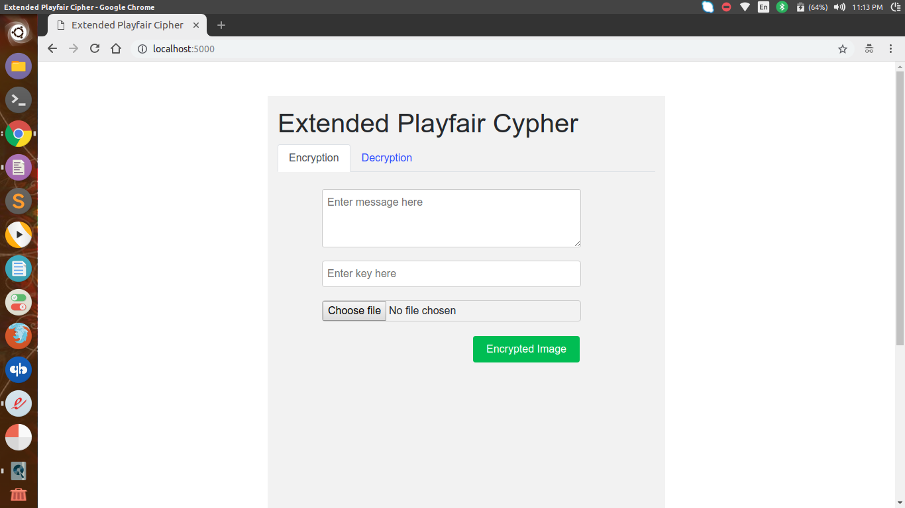
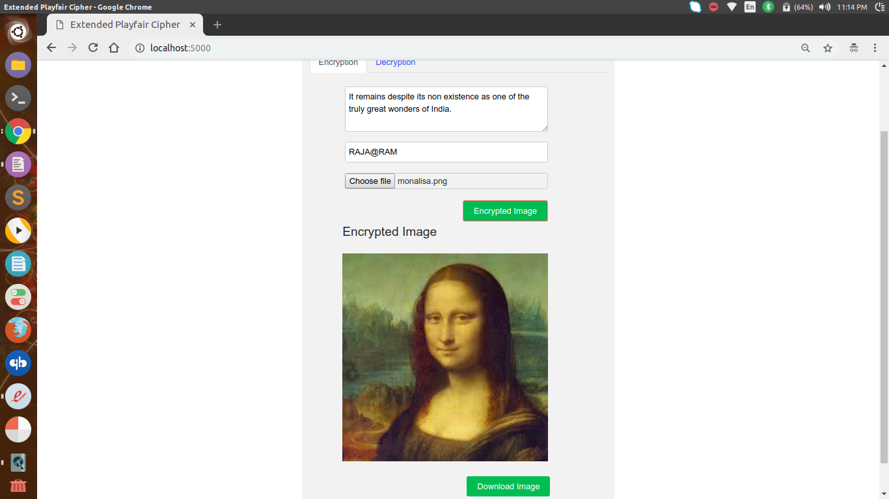
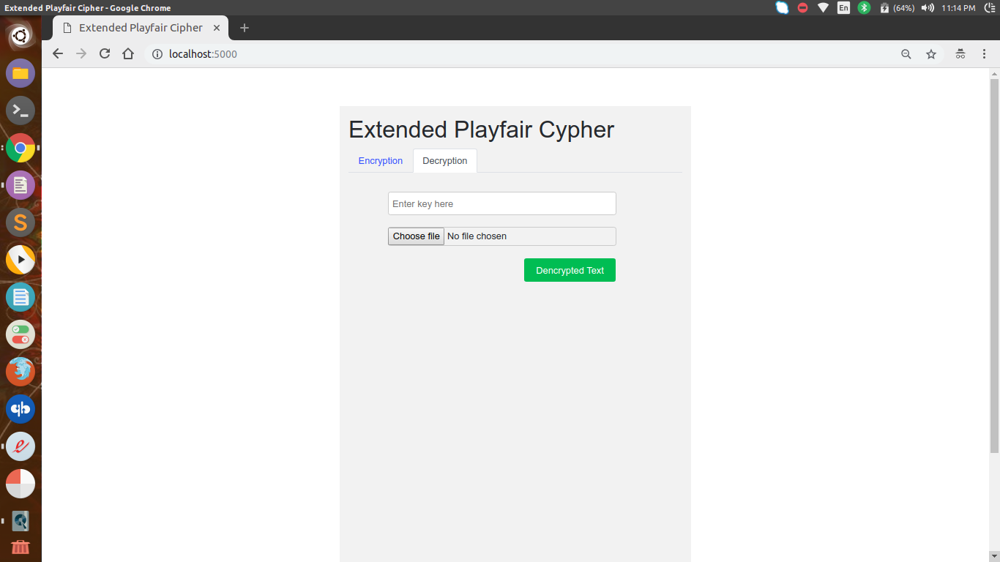
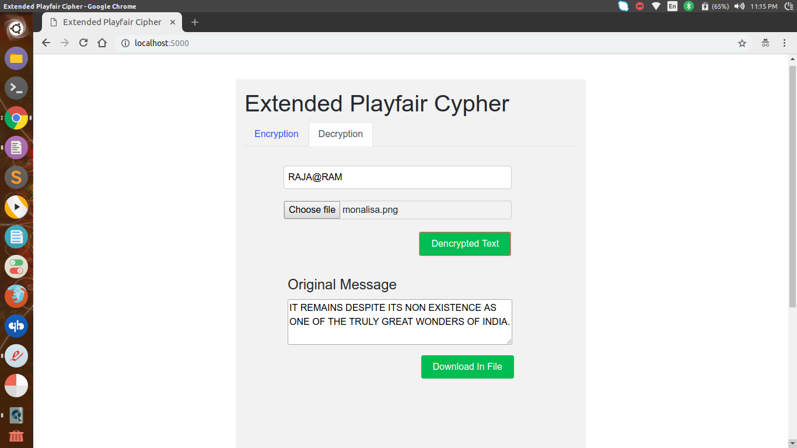

# ExtendedPlayFairCipher
Combining Modified Extended 8*8 Playfair Cipher with Steganography

## Modified 8x8 Playfair Cipher

Uses 8x8 Matrix which have following advantages over
traditional 5x5 Playfair cipher

Can encrypt:
1. All 26 English alphabets [A…Z]
2. All then numerical digits [0…9]
3. 28 Special charaters from keyboard
!@#$%^&*()_+={}[]|\:’;.<>?/,

Also gives us idea about spacing by using symbol | to
symbolize spacing between two words.

64! different types of matrix are possible

64x64=4096 different types of digrams possible

Also we encrypt odd places bigrams position using simple key matrix and for even places bigrams position with transpose of key matrix for more diffusion.

After that we also apply rail fence for more diffusion in ciphertext

## Steganography 
Hiding the message using image as a cover.

The very notion of message being transferred is made
hidden.

## Encryption
Encryption of message is done in 3 parts:

Firstly, message is encrypted using 8x8 Playfair encryption
algorithm to generate intermediate ciphertext. Odd placese bigrams encrypted using simple matrix 8*8, even places bigrams with transpose of matrix for more diffusion in ciphertext.

Then, this intermediate ciphertext is encrypted using Rail
fence encryption algorithm for more diffusion in ciphertext.

Then, this ciphertext is hide in image using steganography using 3 pixels and there rgb bits so that total 9 bits. 9th bit tells about next value and 8 bits ko store value.

## Decryption
Similarly, decryption of encrypted message is also done in 3
parts:

Firstly, we get ciphertext from the image using steganography.

Then, ciphertext is encrypted using Rail fence encryption
algorithm. to generate intermediate ciphertext.

Then, this intermediate ciphertext is decrypted using 8x8
Playfair decryption algorithm.

